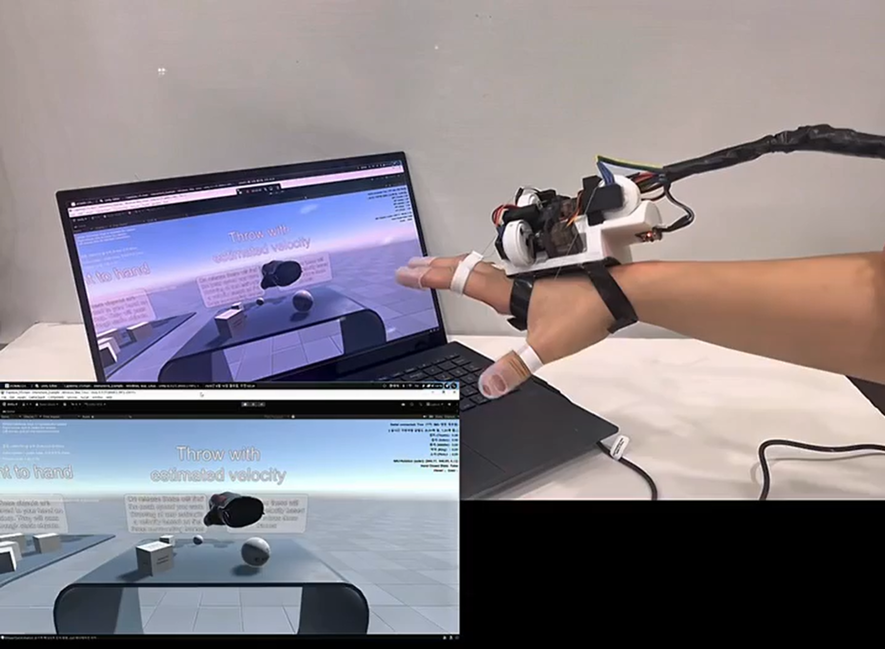
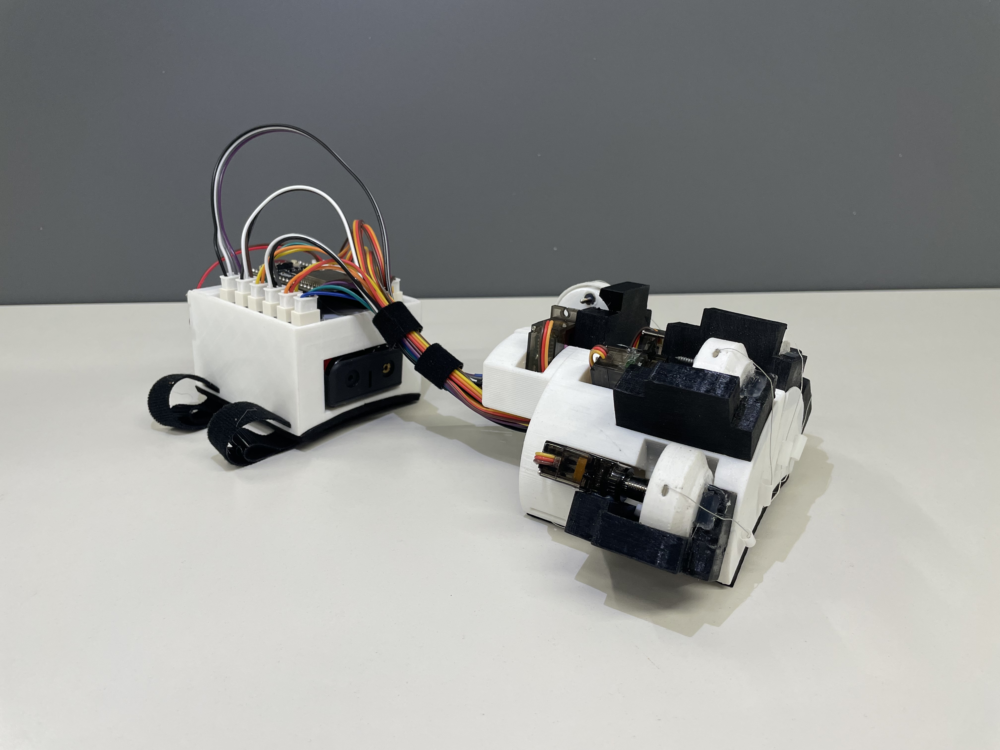

# 고잉메리호 — 웹캠 기반 저비용 VR 햅틱 글러브

시판 VR 컨트롤러는 진동(vibration)만으로 촉각을 흉내 낼 뿐, 가상 물체를 쥐었을 때 실제
손가락을 물리적으로 막아주지 못합니다. 저희는 **단일 웹캠 기반 손 위치 추적 + 관성센서(IMU)
융합 + 손가락별 기계식 스토퍼**를 통해, 저비용 하드웨어만으로 실제 물체를 쥐는 듯한 저항감을
구현했습니다.

## 시연 모습

<table>
  <tr>
    <td width="50%">
      
      <p align="center"><sub>실제 손의 파지 동작이 실시간으로 Unity 가상 손에 그대로 반영됩니다</sub></p>
    </td>
    <td width="50%">
      
      <p align="center"><sub>손가락 관절부 — 서보모터가 회전축과 수직으로 배치되어 물리적 저항을 생성합니다</sub></p>
    </td>
  </tr>
</table>

---

## 개발 배경 & 핵심 아이디어

기존 VR 시스템에서는 가상 물체에 손이 닿아도 실제 손에는 아무런 저항이 느껴지지 않아, 눈으로
보는 것과 손으로 느끼는 것 사이에 괴리가 생깁니다. 저희는 이 문제를 해결하고자 가상 물체를
잡는 순간 손가락의 움직임을 물리적으로 제한해, 실제 물체를 쥐는 듯한 감각을 전달하는 VR
햅틱 글러브를 개발했습니다. 덕분에 사용자는 가상 공간에서도 물체의 크기와 부피를 직관적으로
느낄 수 있습니다.

## 핵심 기술

- **저비용 단일 웹캠 3D 트래킹**: 깊이 카메라나 다중 카메라 없이, AprilTag 마커 인식 +
  solvePnP로 손의 3차원 위치를 실시간 추정 (60FPS)
- **다중 마커 중첩 인식 안정화**: 손등처럼 한 면에 마커가 여러 개(모터 사이사이 3개) 붙어
  한 앵글에 동시에 잡히는 경우, 크기 비교에 히스테리시스를 적용해 잦은 전환을 억제하고,
  마커별 고정 위치 오프셋을 현재 측정 회전만큼 회전시켜 더해 전환 시 위치 튐을 최소화
- **기계식 물리 햅틱 (Lucas Glove 방식)**: 서보모터를 회전축과 수직으로 배치해, 전자적 힘
  제어 없이도 물체 크기에 맞는 저항감을 물리적으로 구현 — 릴 내부 스프링이 와이어 장력을
  항상 팽팽하게 유지하고, 가변저항으로 굽힘 정도를 측정
- **물리 기반 손-물체 충돌**: 손 모델에 손가락 관절별 콜라이더를 부착해, 가상 손이 물체를
  실제로 밀어내는 물리적 충돌을 구현 (기존에는 손이 물체를 그대로 통과했음)
- **물체별 손가락 반응 커스터마이징**: 잡는 물체마다 손가락별 굽힘 한계(0~180도 서보 각도)·
  손모양·grab 판정 기준을 독립적으로 설정 가능해, 물체 크기에 따라 다른 파지감 구현

## 동작 흐름

시스템 구동 후 3초간 손가락 캘리브레이션을 수행하여 사용자별 손 크기와 착용 위치 차이를
보정합니다. 이후 웹캠으로 손의 3차원 위치를 인식하고, IMU와 가변저항으로 손목 회전과
손가락 굽힘 정도를 실시간으로 측정하여 Unity의 가상 손에 반영합니다. 가상 물체와의 접촉 및
파지 여부가 감지되면 물체의 크기에 대응하는 손가락별 굽힘 제한 위치를 계산합니다. 계산된
값은 햅틱 명령으로 변환되어 ESP32로 전달되며, 서보모터와 릴-스토퍼가 손가락의 추가 굽힘을
물리적으로 제한함으로써 가상 물체의 부피감과 저항감을 구현합니다.

---

## 시스템 구조

```
[웹캠]
   ↓ (ArUco/AprilTag 마커 인식, OpenCvSharp)
[손 위치]
   ↓
[Unity 가상 손]  ←──  [아두이노: 포텐셔미터(손가락 굽힘) + MPU6050(손 회전, IMU)]
   ↓                        ↑ USB 시리얼 (115200 baud)
[물체 grab/throw,          [서보모터 (손가락별 저항, Lucas Glove 방식)]
 물리적 충돌]
```

- **위치**: 손 여러 면(손바닥/정면/손날/손등)에 AprilTag(36h11) 마커 총 6개를 붙이고,
  웹캠으로 인식 — 손등은 모터 사이사이에 3개가 있어 한 앵글에 여러 개가 동시에 잡힐 수
  있는데, 히스테리시스 + 마커별 위치 오프셋으로 전환 시 튐을 최소화
- **회전**: MPU6050(IMU)이 전담 (마커 회전 기반 자동 보정은 실험해봤으나, 튜닝 복잡도 대비
  이득이 크지 않아 현재는 순수 IMU만 사용)
- **손가락 굽힘**: 포텐셔미터 5개(엄지~소지) 값을 시리얼로 수신해 가상 손에 반영
- **잡기**: 물체를 잡으면 그 물체에 맞는 손모양으로 자동 전환, 손 위치·회전 보정까지
  정확히 반영되어 스냅됨
- **물리적 충돌**: 손가락 관절별 콜라이더로, 가상 손이 물체에 실제로 부딪혀 밀어낼 수 있음
- **햅틱**: 손가락별 서보모터가 물체 크기에 맞는 각도(0~180도)로 미리 세팅되어, 실제
  저항은 기계 구조가 담당

## 개발 환경

| 항목 | 버전 |
|---|---|
| Unity | 6.3 LTS (6000.3.19f1) |
| 렌더 파이프라인 | Built-in |
| API Compatibility Level | .NET Framework |
| 컴퓨터 비전 | OpenCvSharp4 (NuGet) |
| 마커 시스템 | ArUco / AprilTag (36h11) |
| 베이스 | SteamVR Interaction System (OpenVR 의존성 제거 후 커스터마이징) |
| 아두이노 | ESP32 + MPU6050 (DMP) + 가변저항 5개 + 서보모터 5개 |

## 팀원

| 역할 | 이름 | 담당 |
|---|---|---|
| 팀장 | 최호민 | |
| 팀원 | 김동휘 | |
| 팀원 | 권민규 | |
| 팀원 | 배건우 | Unity / 컴퓨터 비전 |
| 팀원 | 이서우 | |

지도교수: 김선용 교수님 | 산업체 멘토: 한화 비전 연구원 김나연

---

## 직접 실행해보기 (개발/심사용)

### 1. 저장소 클론
```bash
git clone https://github.com/gwbae0904/Capstone_V3.git
```

### 2. Unity로 열기
Unity Hub → Open → 클론한 폴더 선택. Unity 6.3 LTS(6000.3.19f1)가 없으면 Unity Hub에서 먼저 설치.

### 3. NuGetForUnity로 OpenCvSharp 설치
`Assets/Packages/`는 용량 문제로 저장소에 포함되어 있지 않아, **클론 후 직접 설치해야 합니다.**

1. [NuGetForUnity 릴리즈 페이지](https://github.com/GlitchEnzo/NuGetForUnity/releases)에서 최신 `.unitypackage` 다운로드 후 Import
2. `NuGet → Manage NuGet Packages`에서 `OpenCvSharp4`, `OpenCvSharp4.runtime.win` 설치

### 4. API Compatibility Level 변경
`Edit → Project Settings → Player → Other Settings → Configuration → Api Compatibility Level`을
**`.NET Framework`**로 변경 (시리얼 통신에 필수).

### 5. 카메라 준비
- 사용할 웹캠이 여러 개 연결되어 있으면, `ArucoHandTracker`의 `Preferred Camera Name`에
  원하는 카메라 이름의 일부를 입력 (예: `FHD60F`). Play 시 Console에 연결된 카메라 전체
  목록이 출력되니, 정확한 이름이 헷갈리면 거기서 확인
- 마커: 딕셔너리 `AprilTag 36h11`, 크기: 웹캠-손 거리 30~40cm 기준 2cm × 2cm 권장
- [chev.me/arucogen](https://chev.me/arucogen) 등에서 생성, ID는 `ArucoHandTracker`의 `Markers` 리스트와 일치해야 함

### 6. 아두이노
- `Arduino/GloveFirmware/GloveFirmware.ino` 참고
- 시리얼 프로토콜(115200 baud): `c0,c1,c2,c3,c4,qw,qx,qy,qz` (curl 5개 + IMU 쿼터니언), 명령어 `t`(영점 재조절)/`r`(3초 손가락 캘리브레이션)/`H,각도1,...,각도5`(0~180도 서보 각도 직접 지정)

### 7. Play
`DotTracker` 선택 → 웹캠/마커 인식 확인 후 실행. **`Esc` 키로 언제든 종료 가능** (빌드본 포함)

---

## 임베디드 펌웨어 (ESP32)

`Arduino/GloveFirmware/GloveFirmware.ino`

- **MPU6050 DMP(Digital Motion Processor) 기반 센서 퓨전**: 가속도계·자이로 원시값을
  직접 다루는 대신, 칩 내장 DMP가 실시간으로 쿼터니언을 계산해 CPU 부담 없이 안정적인
  회전값 확보. 기준 자세(tare) 대비 상대 쿼터니언을 자체 계산해 전송
- **부팅 시 자동 손가락 캘리브레이션**: 전원이 켜지면 3초간 자동으로 각 손가락의
  가변저항 최소/최대값을 측정, 착용자마다 다른 손 크기·센서 위치 편차를 사람 손으로
  건드리지 않고 자동 보정. 이후 `r` 명령으로 언제든 재캘리브레이션 가능
- **양방향 시리얼 프로토콜**: 센서값을 일방적으로 송신하는 데 그치지 않고, PC(Unity)로부터
  `t`(IMU 영점 재조절), `r`(손가락 재캘리브레이션), `H,각도1,...,각도5`(손가락별 서보 각도
  직접 지정) 명령을 수신해 처리하는 양방향 구조로 설계
- **논블로킹 메인 루프**: `delay()`로 대기하는 구간 없이 센서 읽기·서보 갱신·시리얼 송수신이
  한 루프 안에서 매끄럽게 반복되어, 손가락 굽힘 반영과 햅틱 반응 모두 지연 없이 동작
- **손가락별 독립 보정**: 센서 방향(`flipCurl`)과 서보 회전 방향(`servoReverse`)을
  손가락마다 따로 설정할 수 있어, 하드웨어 조립 편차를 코드 레벨에서 흡수

---

## 빌드 & 배포 참고사항

- **빌드는 몇 번이든 다시 할 수 있음**, 별도 저장 데이터가 없어 이전 빌드 폴더는 그냥 지우고 새로 만들어도 안전
- **다른 PC에서 실행하려면**: 빌드 폴더 전체를 zip으로 압축 → 옮겨서 압축 해제 후 실행. 단, 대상 PC에 아래가 별도로 필요:
  - Microsoft Visual C++ 재배포 패키지 (OpenCvSharp 네이티브 라이브러리 구동에 필요)
  - 아두이노 USB-시리얼 드라이버 (보드 종류에 따라 CP210x/CH340 등)
  - 웹캠 접근 권한(최초 실행 시 Windows가 물어봄), 출처 미상 앱 경고(SmartScreen) 시 "추가 정보 → 실행"
- **iOS(아이패드)/라즈베리파이는 사실상 배포 불가**: `OpenCvSharp4`가 iOS 런타임 패키지를
  제공하지 않고 `System.IO.Ports.SerialPort`도 iOS에서 동작하지 않음. 라즈베리파이(ARM
  리눅스)는 OpenCvSharp 자체는 패키지가 있으나 Unity가 Standalone ARM Linux 빌드를
  일반적으로 지원하지 않아 비현실적. Windows PC 기반 유지가 현실적인 선택

## 더 자세한 개발 기록

트래킹 방식 선정 과정, 겪었던 버그와 해결 방법, 설계 결정 배경 등 상세한 개발 기록은
[`docs/DEVELOPMENT_LOG.md`](docs/DEVELOPMENT_LOG.md)에 정리되어 있습니다.
